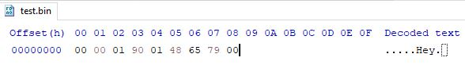

# Carpenter

Create multiple config files easily.

## Support
- Support for all Sized integers
- Support for Strings
- Lightweight
- Saves as binary for small file size

## Installation/Usage
#### Installation
To use this crate you need these dependencies:
```toml
[dependencies]
bytestream = "0.4.1"
carpenter = "0.0.1"
```

#### Usage
```rust
use carpenter::ConfigManager;

// Create a struct and derive it with ConfigManager
#[derive(ConfigManager, PartialEq, Debug)]
struct Config {
    _a: i32,
    _b: bool,
    _c: String,
}

fn main() {
    // Create config builder
    let config_factory = Config::init_config(
        "meloencoding", // username
        "config-rs-test", // application name
        "test.bin" // config file name
    );

    // To save your config
    let sample_config = Config {
        _a: 400,
        _b: true,
        _c: String::from("Hey"),
    };

    config_factory.save(&sample_config);

    // To read the saved config
    assert_eq!(sample_config, config_factory.read());
}
```

## Config file in a HxD
- Byte order is *Big endian*. 
- **i32** = 4 bytes so 0x00-0x03 is 0x00_00_01_90 which is 400 in decimal. 
- **bool** = 1 byte so 0x04-0x04 is 0x01 which is true in rust.
- **String** = is in this case 4 bytes so 0x05-0x08 is 0x48_65_79_00 which is "Hey\0". String gets null terminated.

